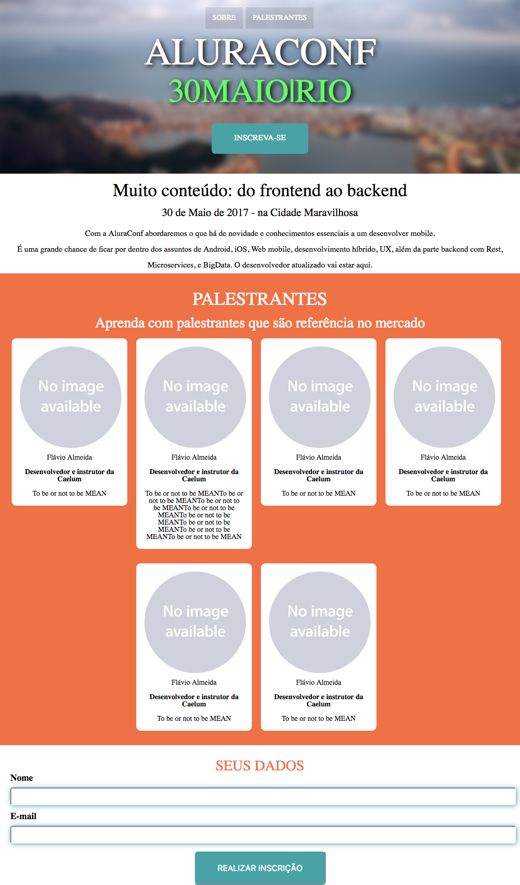
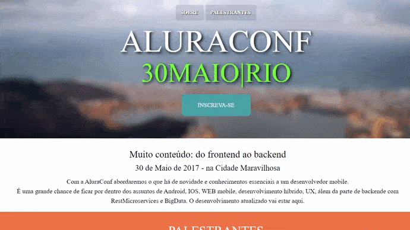

<h1 align="center">
   AluraConf
</h1>

### Programa Acelera Dev - TIVIT e MCIO

 

## Layout

  

 

## Demonstração

  

 

## Demonstração Validação da Inscrição

  

## Tecnologias

Esse projeto foi desenvolvido com as seguintes tecnologias:

✔️ HTML5 e CSS3 

✔️ JavaScript

✔️ Web Design Responsivo

✔️JQuery

## 💻 Projeto

Projeto de conclusão curso de Frontend da Alura. 

AluraConf é uma página de conferência, que exibe informações do evento, palestrantes, formulário de contato entre outras informações.

---
